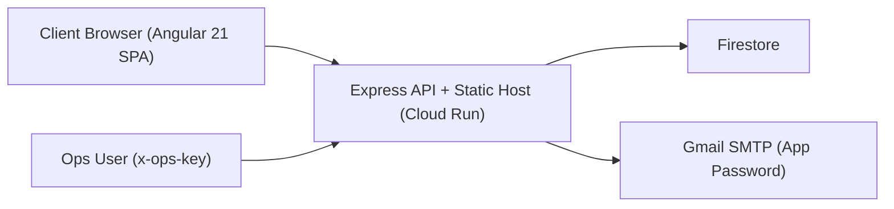

# LAFL Logistics Portal

Modern logistics platform with an Angular 21 frontend and Express backend for lead capture, shipment visibility, and operations monitoring.

Live URL: [https://lafl-logistics-portal-496585032737.us-central1.run.app](https://lafl-logistics-portal-496585032737.us-central1.run.app)

## Why This Project

This project was rebuilt end-to-end to demonstrate practical full-stack ownership:

- Angular 21 single-page frontend with responsive UX
- production-style API design with validation
- cloud-native persistence on Firestore
- email notifications through Gmail SMTP
- Cloud Run deployment and environment-driven configuration
- protected operations endpoints for internal monitoring

## Core Capabilities

- Angular-routed pages for home, signup, and signup-success flows
- Shipment tracking API and UI with issue-state simulation
- Contact, quote, and signup workflows
- Firestore persistence in cloud mode with local JSON fallback
- Notification email templates for inbound submissions
- Ops APIs secured by `OPS_API_KEY`

## Demo Shipment IDs

- `LAFL-24017` (healthy path)
- `LAFL-98241` (active issues)
- `LAFL-77802` (low-priority exception)

## Architecture



## API Reference

Public endpoints:

- `GET /api/health`
- `GET /api/track?reference=LAFL-98241`
- `POST /api/contact`
- `POST /api/quotes`
- `POST /api/signup`

Protected ops endpoints (`x-ops-key` required):

- `GET /api/ops/overview`
- `GET /api/ops/issues`

## Quick Start (Local)

1. Install backend dependencies:
   ```bash
   npm install
   ```
2. Install frontend dependencies:
   ```bash
   npm --prefix frontend install
   ```
3. Authenticate ADC for Firestore (optional but recommended):
   ```bash
   gcloud auth application-default login
   ```
4. Copy environment template and fill values:
   ```bash
   cp .env.example .env
   ```
5. Build Angular frontend:
   ```bash
   npm run frontend:build
   ```
6. Run the app:
   ```bash
   npm run dev
   ```
7. Open:
   `http://localhost:3000`

## Environment Variables

Use `.env.example` as a template.

- `PORT`: app port (default `3000`)
- `APP_BASE_URL`: public app URL used in email templates
- `PROJECT_ID`: Google Cloud project id
- `USE_FIRESTORE`: `true` to persist in Firestore
- `OPS_API_KEY`: required for ops endpoints
- `SMTP_HOST`, `SMTP_PORT`, `SMTP_SECURE`: SMTP server settings
- `SMTP_USER`, `SMTP_PASS`: SMTP credentials
- `MAIL_FROM`, `MAIL_TO`: sender and recipient inboxes

## Deploy to Cloud Run

Prerequisites:

- Google Cloud SDK installed
- billing enabled
- `Cloud Run Admin API`, `Cloud Build API`, and `Firestore API` enabled
- Firestore database created in Native mode

Deploy:

```bash
export PROJECT_ID=logistics-491417
export REGION=us-central1
export USE_FIRESTORE=true
export OPS_API_KEY="$(openssl rand -hex 32)"
export SMTP_USER="your_gmail@gmail.com"
export SMTP_PASS="your_16_digit_app_password"
export MAIL_FROM="your_gmail@gmail.com"
export MAIL_TO="your_gmail@gmail.com"
./deploy/cloud-run.sh
```

## Security Notes

- Do not commit `.env` or real credentials.
- Use Gmail app passwords, never your primary Gmail password.
- If any secret is accidentally exposed, rotate it immediately.
- Passwords are stored as salted hashes.

## Repository Structure

- `frontend/`: Angular 21 application source
- `index.js`: Express server and API routes
- `public/`: legacy fallback assets and static media
- `data/`: local fallback data store
- `deploy/cloud-run.sh`: deployment helper
- `Dockerfile`: container definition

## Portfolio Talking Points

- End-to-end migration from legacy static pages to Angular + cloud-ready architecture
- Firestore-backed server logic with environment-aware fallback
- Operational observability via protected summary endpoints
- Real-world notification path integrated with Gmail SMTP
- Responsive, high-contrast UI with improved UX for form workflows
