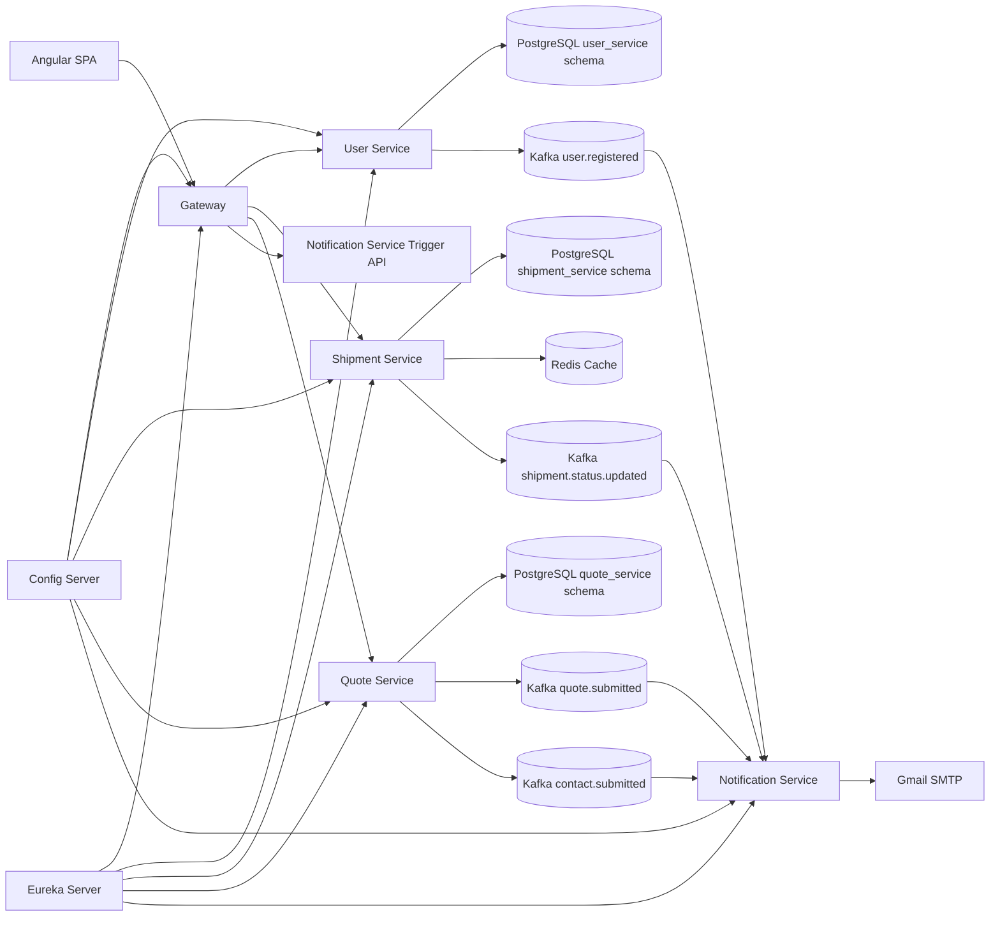
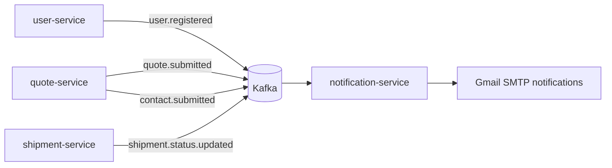

# LAFL Logistics Platform

Production-grade microservices logistics platform built with Spring Boot, Spring Cloud, Kafka, PostgreSQL, Redis, and Angular - deployed on SAP BTP Cloud Foundry.


## Live Demo

- Gateway URL: `https://gateway-turbulent-wolf-ap.cfapps.us10-001.hana.ondemand.com`
- Frontend URL: `https://lafl-frontend-daring-civet-ri.cfapps.us10-001.hana.ondemand.com`
- Latest verified deploy: GitHub Actions run `23718881802` on March 29, 2026

Example curls (5 core endpoints):

```bash
BASE="https://gateway-turbulent-wolf-ap.cfapps.us10-001.hana.ondemand.com"

# 1) Gateway health
curl -s "$BASE/api/health"

# 2) Shipment tracking
curl -s "$BASE/api/v1/shipments/track?reference=LAFL-24017"

# 3) User signup
curl -s -X POST "$BASE/api/v1/auth/signup" \
  -H "Content-Type: application/json" \
  -d '{"name":"Demo User","email":"demo@example.com","company":"LAFL","password":"ChangeMe123!"}'

# 4) Quote submission
curl -s -X POST "$BASE/api/v1/quotes" \
  -H "Content-Type: application/json" \
  -d '{"company":"LAFL","contactName":"Demo User","email":"demo@example.com","serviceType":"Freight Forwarding","origin":"NYC","destination":"SFO","shipmentType":"Air","cargoDetails":"5 pallets"}'

# 5) Contact submission
curl -s -X POST "$BASE/api/v1/contacts" \
  -H "Content-Type: application/json" \
  -d '{"name":"Demo User","email":"demo@example.com","company":"LAFL","message":"Need a logistics quote"}'
```

## Migration Story

The project started as a Node/Express monolith and scored roughly 4/10 for migration readiness: limited service boundaries, minimal eventing, and no production-grade deployment choreography. It was rebuilt into a Spring Boot microservices platform with service discovery, centralized configuration, event-driven notifications, and gateway-level security enforcement. The new architecture now covers core enterprise logistics patterns: distributed services, asynchronous Kafka workflows, schema-managed persistence, and cloud deployment automation. The result is a significantly more production-aligned foundation that maps to the day-to-day stack used by large logistics engineering teams.

## Architecture



## Tech Stack

| Layer | Technology | Purpose |
|---|---|---|
| Frontend | Angular 20 | SPA for tracking, signup, quote, and contact flows |
| API Edge | Spring Cloud Gateway | Central routing, JWT verification, RBAC enforcement |
| Service Discovery | Eureka | Dynamic service registration and discovery |
| Config | Spring Cloud Config Server | Centralized runtime config from environment |
| Microservices | Spring Boot 3.3.x | Core business services |
| Auth | JWT + BCrypt | Token issuance/validation and secure password hashing |
| Messaging | Kafka / Redpanda | Event-driven notifications and decoupled workflows |
| Data | PostgreSQL (Supabase) | Relational persistence across service schemas |
| Migrations | Flyway | Versioned database schema migrations |
| Cache | Redis (Upstash TLS in cloud) | Shipment tracking response caching |
| Email | Gmail SMTP | Real-time notification delivery |
| Deployment | SAP BTP Cloud Foundry | Managed runtime for all services |
| CI/CD | GitHub Actions | Test, build, deploy backend + frontend, smoke test |

## Service Breakdown

| Service | What It Does | Key Endpoints | Database | Kafka Topics |
|---|---|---|---|---|
| `config-server` | Central config source for runtime values | N/A (config infrastructure) | None | None |
| `eureka-server` | Service registry/discovery | `/eureka/*` | None | None |
| `gateway` | API routing, JWT validation, RBAC checks | `/api/health` + routed `/api/v1/*` | None | None |
| `user-service` | Signup/login, JWT issuing, account management | `POST /api/v1/auth/signup`, `POST /api/v1/auth/login` | `user_service` schema | Produces `user.registered` |
| `shipment-service` | Shipment tracking + status updates + cache | `GET /api/v1/shipments/track`, `PATCH /api/v1/shipments/{reference}/status` | `shipment_service` schema | Produces `shipment.status.updated` |
| `quote-service` | Quote and contact intake + ops views | `POST /api/v1/quotes`, `POST /api/v1/contacts`, `GET /api/v1/ops/overview`, `GET /api/v1/ops/issues` | `quote_service` schema | Produces `quote.submitted`, `contact.submitted` |
| `notification-service` | Consumes Kafka events and sends SMTP mail | `POST /api/v1/notifications/trigger` (ops trigger) | None | Consumes all 4 topics |

## Kafka Event Flow



Topics in use:
- `user.registered`
- `quote.submitted`
- `contact.submitted`
- `shipment.status.updated`

## Security Model

- JWTs are issued by `user-service` after successful signup/login.
- `gateway` validates incoming Bearer tokens using `jwt.secret` and rejects invalid tokens.
- RBAC is enforced at gateway level:
  - Ops-only access for `GET /api/v1/ops/**` and `POST /api/v1/notifications/**`
  - Auth-required routes for write operations such as shipment status changes
- Passwords are hashed with BCrypt before persistence.

## Database Design

- PostgreSQL runs with 3 service-owned schemas:
  - `shipment_service`
  - `user_service`
  - `quote_service`
- Flyway migrations are applied per service at startup.
- Production uses Supabase PostgreSQL via environment-injected `DB_URL` (pooler URL recommended).

## Redis Caching

- `shipment-service` caches tracking lookups in Redis.
- Cache key: shipment reference.
- TTL: 10 minutes.
- Eviction: automatic on shipment status update (`@CacheEvict`).

## Local Development Quickstart

Prerequisites:
- Java 17+
- Docker + Docker Compose
- Node.js 20+

Build all backend jars:

```bash
cd lafl-platform
./build-all.sh
```

Run platform locally:

```bash
cd lafl-platform
docker compose up --build -d
```

Smoke test locally:

```bash
BASE="http://localhost:8080"
curl -s "$BASE/api/health"
curl -s "$BASE/api/v1/shipments/track?reference=LAFL-24017"
```

Useful local dashboards:
- Eureka: `http://localhost:8761`
- Mailhog UI: `http://localhost:8025`

## Production Deployment (SAP BTP + GitHub Actions)

### Required GitHub Secrets

| Secret | Description |
|---|---|
| `CF_API` | Cloud Foundry API endpoint |
| `CF_USERNAME` | Cloud Foundry username |
| `CF_PASSWORD` | Cloud Foundry password |
| `CF_ORG` | Cloud Foundry org |
| `CF_SPACE` | Cloud Foundry space |
| `DB_URL` | Supabase/PostgreSQL JDBC URL |
| `DB_USER` | PostgreSQL username |
| `DB_PASS` | PostgreSQL password |
| `JWT_SECRET` | JWT signing secret |
| `KAFKA_BROKERS` | Redpanda bootstrap brokers |
| `KAFKA_SECURITY_PROTOCOL` | Kafka protocol (`SASL_SSL`) |
| `KAFKA_SASL_MECHANISM` | Kafka mechanism (`SCRAM-SHA-256`/`SCRAM-SHA-512`/`PLAIN`) |
| `KAFKA_USERNAME` | Redpanda SASL username |
| `KAFKA_PASSWORD` | Redpanda SASL password |
| `REDIS_HOST` | Upstash Redis host |
| `REDIS_PORT` | Upstash Redis port |
| `REDIS_PASSWORD` | Upstash Redis password |
| `SMTP_HOST` | Gmail SMTP host (`smtp.gmail.com`) |
| `SMTP_PORT` | Gmail SMTP port (`587`) |
| `SMTP_USER` | Gmail SMTP username |
| `SMTP_PASS` | Gmail app password |
| `MAIL_FROM` | Sender email |
| `MAIL_TO` | Recipient email |

### Startup Order

1. `config-server`
2. `eureka-server`
3. `shipment-service`
4. `user-service`
5. `quote-service`
6. `notification-service`
7. `gateway`
8. `lafl-frontend`

### Useful CF Commands

```bash
cf apps
cf app gateway
cf app lafl-frontend
cf logs gateway --recent
```

## Frontend (Angular SPA)

Local dev:

```bash
cd frontend
npm ci
npx ng serve
```

Build for production:

```bash
cd frontend
npx ng build --configuration production
```

Environment routing:
- `src/environments/environment.ts` -> local gateway (`http://localhost:8080`)
- `src/environments/environment.prod.ts` -> Cloud Foundry gateway URL

Cloud Foundry deployment:
- Staticfile buildpack via `frontend/manifest.yml`
- Build output path: `dist/frontend/browser`
- Live app route (current): `lafl-frontend-daring-civet-ri.cfapps.us10-001.hana.ondemand.com`

## CI/CD Pipeline

GitHub Actions workflow (`.github/workflows/lafl-platform-ci.yml`) executes:

1. Run Gradle tests.
2. Build backend artifacts.
3. Authenticate to Cloud Foundry.
4. Deploy 7 backend services in startup order.
5. Inject required env vars/secrets per service.
6. Bootstrap Kafka topics before service startup.
7. Build and deploy Angular frontend (`lafl-frontend`).
8. Run smoke tests against gateway endpoints.

## Improvement Roadmap

- Move to fully managed Kafka with stronger partition strategy and DLQ policies.
- Enable Redis cluster mode and cross-zone failover for cache resilience.
- Persist frontend auth state securely with refresh-token lifecycle support.
- Add mobile app clients (driver/ops experiences) on top of existing APIs.
- Reintroduce and tune gateway rate limiting backed by Redis for production traffic control.
