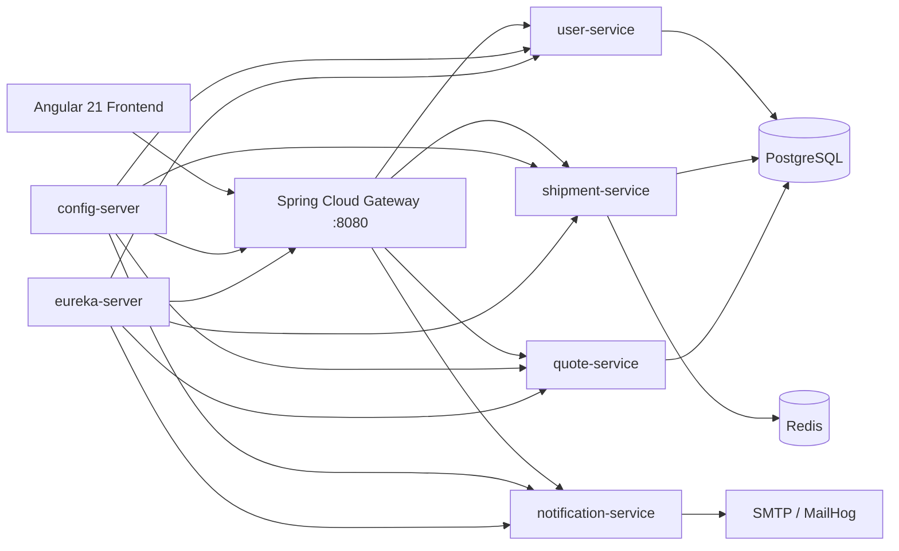

# LAFL Logistics Platform

Cloud-native logistics portfolio platform with an Angular 21 frontend and a Spring Boot microservices backend behind Spring Cloud Gateway.

## What Recruiters Can Validate Quickly

- Real microservices decomposition (Gateway + Config Server + Eureka + 4 domain services)
- JWT auth and RBAC enforced at the gateway edge
- Redis caching with explicit TTL + eviction behavior
- OpenAPI/Swagger docs on core services
- Cloud Foundry manifests + GitHub Actions CI/CD pipeline
- One-command local startup with Docker Compose

## Current Architecture (Primary Path)



## Implemented Backend Capabilities

### API Gateway (Spring Cloud Gateway)

- JWT Bearer validation using `jwt.secret` from Config Server
- Adds `X-User-Id` and `X-User-Role` headers downstream after successful auth
- Route policy:
  - Public: `GET /api/v1/shipments/track`, `POST /api/v1/quotes/**`, `POST /api/v1/contacts/**`, `POST /api/v1/auth/**`
  - Valid JWT required: `POST /api/v1/shipments/**`
  - `ROLE_OPS` required: `GET /api/v1/ops/**`
- Gateway health endpoint: `GET /api/health`

### User Service

- `POST /api/v1/auth/signup`
- `POST /api/v1/auth/login` with BCrypt password verification
- JWT issuance with `sub`, `role`, `iat`, `exp` (24h)
- Uses PostgreSQL via JPA repository (`UserAccountRepository`)

### Shipment Service

- Tracking and status update APIs (`/api/v1/shipments/...`)
- Redis caching:
  - `@Cacheable` on tracking lookup (`shipments` cache)
  - `@CacheEvict` on status update
  - TTL configured to 10 minutes

### Quote Service

- `POST /api/v1/quotes`
- `POST /api/v1/contacts`
- Ops read endpoints:
  - `GET /api/v1/ops/overview`
  - `GET /api/v1/ops/issues`

### Notification Service

- Dispatches event-specific notification email logic (SMTP)
- Demo trigger endpoint: `POST /api/v1/notifications/trigger`

### OpenAPI / Swagger

Enabled for:

- `shipment-service`
- `user-service`
- `quote-service`

Endpoints per service:

- Swagger UI: `/swagger-ui.html`
- OpenAPI JSON: `/v3/api-docs`

Each includes a Bearer JWT security scheme for authenticated endpoint testing.

## Frontend Integration

Angular app is now wired to the Spring gateway (`http://localhost:8080`) in `frontend/src/app/api.service.ts` for:

- shipment tracking
- quote submission
- contact submission
- user signup

## Database Targets

- Production/Cloud: Supabase PostgreSQL (`jdbc:postgresql://db.epvdfxwkqdaaeornsotb.supabase.co:5432/postgres`)
- Local development: Docker Compose PostgreSQL container

## Local Development

### Prerequisites

- Docker + Docker Compose
- Java 17+
- Node.js 20+

### 1. Start Platform Stack (one command)

```bash
docker compose -f lafl-platform/docker-compose.yml up --build
```

This starts PostgreSQL, Redis, Config Server, Eureka, Gateway, shipment-service, user-service, quote-service, and notification-service.
For production deployments, services connect to Supabase PostgreSQL through environment variables.

Useful local endpoints:

- Gateway: `http://localhost:8080`
- Config Server: `http://localhost:8888`
- Eureka: `http://localhost:8761`
- MailHog UI: `http://localhost:8025`

### 2. Run Angular Frontend

```bash
npm --prefix frontend install
npm --prefix frontend start
```

Frontend dev URL: `http://localhost:4200`

### 3. Run Test Suite

```bash
gradle -p lafl-platform test
```

## Quick API Smoke Flow

### Signup

```bash
curl -X POST http://localhost:8080/api/v1/auth/signup \
  -H "Content-Type: application/json" \
  -d '{
    "name":"Demo User",
    "email":"demo@example.com",
    "company":"LAFL",
    "phone":"555-0100",
    "interest":"Ops dashboard",
    "password":"password123"
  }'
```

### Login and extract JWT

```bash
TOKEN=$(curl -s -X POST http://localhost:8080/api/v1/auth/login \
  -H "Content-Type: application/json" \
  -d '{"email":"demo@example.com","password":"password123"}' | jq -r '.token')
```

### Try ROLE_OPS route

```bash
curl -H "Authorization: Bearer $TOKEN" http://localhost:8080/api/v1/ops/overview
```

## CI/CD

GitHub Actions workflow: `.github/workflows/lafl-platform-ci.yml`

Pipeline stages:

1. `build-and-test` (runs `gradle -p lafl-platform test`)
2. `deploy` (Cloud Foundry `cf push` in startup order)
3. `smoke-test` (`GET /api/health` through gateway)

Required GitHub Secrets:

- `CF_API`
- `CF_USERNAME`
- `CF_PASSWORD`
- `CF_ORG`
- `CF_SPACE`
- `JWT_SECRET`
- `DB_URL`
- `DB_USER`
- `DB_PASS`
- `KAFKA_BROKERS`
- `KAFKA_SECURITY_PROTOCOL`
- `KAFKA_SASL_MECHANISM`
- `KAFKA_USERNAME`
- `KAFKA_PASSWORD`
- `REDIS_HOST`
- `REDIS_PORT`
- `REDIS_PASSWORD`
- `SMTP_HOST`
- `SMTP_PORT`
- `SMTP_USER`
- `SMTP_PASS`
- `MAIL_FROM`
- `MAIL_TO`

## Cloud Foundry Deployment

Manifests exist per module under `lafl-platform/*/manifest.yml`.

Startup order:

1. `config-server`
2. `eureka-server`
3. `shipment-service`
4. `user-service`
5. `quote-service`
6. `notification-service`
7. `gateway`

## Repository Layout

- `frontend/` Angular 21 SPA
- `lafl-platform/` Spring Cloud microservices platform
- `index.js` legacy Express backend retained from pre-migration implementation
- `deploy/` legacy deployment scripts

## Legacy Note

This repo still contains the original Express/Cloud Run implementation for historical context, but active end-to-end platform work is centered on the Spring microservices stack under `lafl-platform/`.
